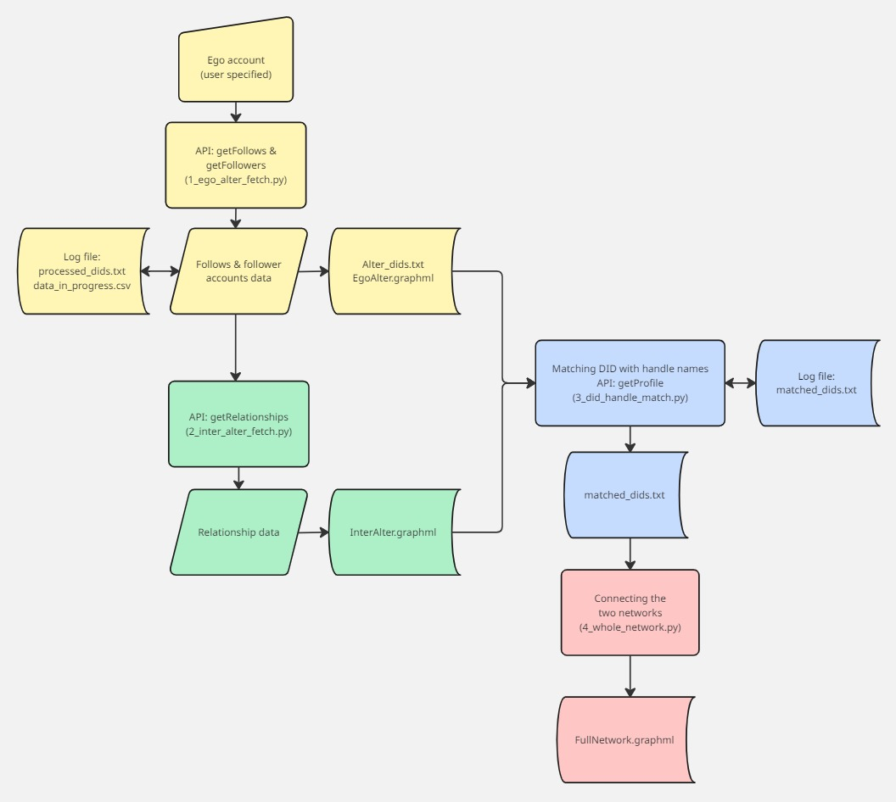

# 🔗 Bluesky Ego-network Builder

  

---

## 🧭 About

**Bluesky Ego-network Builder** is a research tool designed to explore and analyse the social graph of the decentralised Bluesky platform. Starting from a seed user’s handle, it constructs an ego-network by mapping their followers and followings, along with the connections between those users. Data is collected via the official Bluesky API and the resulting network is exported in `.graphml` format using the `networkx` library for further analysis or visualisation.

Developed as part of a Master’s dissertation in Digital Humanities, this tool prioritises transparency, reproducibility, and extensibility in the study of public user relationships on decentralised platforms like Bluesky.

---

## ✨ Key Features

- Retrieve followers and following lists of any public **Bluesky account** using official **Bluesky APIs** (`getFollows`, `getFollowers`, `getRelationships`, `getProfile`)
- Automatically build an **ego-network graph** of the selected user and their connections
- Resolve **DIDs (Decentralized Identifiers)** into readable **handle names** for easier interpretation
- Export the full network as a `.graphml` file using `networkx` for use in tools like Gephi, Cytoscape, or Python-based graph analysis
- Designed for **social network analysis**, **KOL detection**, and **digital humanities applications**

---

## 🎞️ Demo



This tool is composed of four modular Python scripts:

- **`1_ego_alter_fetch.py`** – Fetches the followers and follows accounts of a seed Bluesky user to construct the first layer of the ego network.
- **`2_inter_alter_fetch.py`** – Retrieves mutual following relationships between alters (connections of the ego accounts).
- **`3_did_handle_match.py`** – Resolves DIDs to human-readable handle names using the Bluesky API.
- **`4_whole_network.py`** – Merges all data into a `whole_network.graphml` network file suitable for further analysis and visualisation.

---

## ⚙️ Installation

This project requires **Python 3.12+**

### 📦 Required Libraries

Install the following libraries using `pip`, or your tool of choice:

```
pip install httpx pandas networkx tqdm keyboard requests

```
---

## ⚠️ Known Issues

- **Account Fetching & DID Resolution Failures**  
  Account fetching or DID resolution may sometimes fail, typically when the account has been deactivated or made private. This can happen at either the initial data collection stage or later when matching DIDs with handles. The issue is more likely if there’s a significant delay between generating the DID list and attempting the handle match, during which some users may leave the platform or change their account status.
  In most cases, these missing nodes do not significantly affect overall network analysis—unless the deactivated account was a highly connected or influential node.

- **API Limits**  
  While Bluesky’s API does not enforce strict rate limiting, each endpoint has a fixed batch size (e.g. `getFollowers` and `getFollows` returns 100 users per call, `getRelationships` supports up to 30).  
  These limits are handled automatically in the scripts. If you encounter errors, they are likely due to temporary network issues rather than API constraints. Simply re-run the script to continue.

- **Network Breakdowns and Timeouts**  
  Large-scale traversals or unstable internet connections may result in timeouts or dropped requests during asynchronous operations. Consider rerunning the script or reducing the depth or scope of the traversal in such cases.

---

## 💻 Case Studies
Due to GitHub’s file size limits, the full files for the three case studies are available via this link: https://drive.google.com/drive/folders/1D6KJlTrezpZF3cO6lnp-rpm5s73O8ZEC?usp=drive_link. You can also view the three Markdown interpretations in the cases folder.

---

## 🙏 Acknowledgements

- **APIs & Documentation**  
  - [Bluesky AT Protocol](https://atproto.com)  
  - [Bluesky Doc HTTP Reference](https://docs.bsky.app/docs/category/http-reference)

- **Libraries Used**  
  - [`httpx`](https://www.python-httpx.org/) – Asynchronous HTTP client for API requests  
  - [`pandas`](https://pandas.pydata.org/) – Data manipulation and CSV handling  
  - [`networkx`](https://networkx.org/) – Network graph creation and analysis  
  - [`tqdm`](https://tqdm.github.io/) – Progress bars for loops and async tasks  
  - [`keyboard`](https://github.com/boppreh/keyboard) – Keyboard event detection (optional, platform dependent)  
  - [`requests`](https://requests.readthedocs.io/) – Synchronous HTTP requests

- **Academic Support**  
  - Supervised by **Mark J. Hill**  
  - MA Digital Humanities, King’s College London
---

## 📬 Contact

If you encounter any issues, have feature requests, or want to contribute, feel free to reach out:

📧 billow0612@gmail.com


