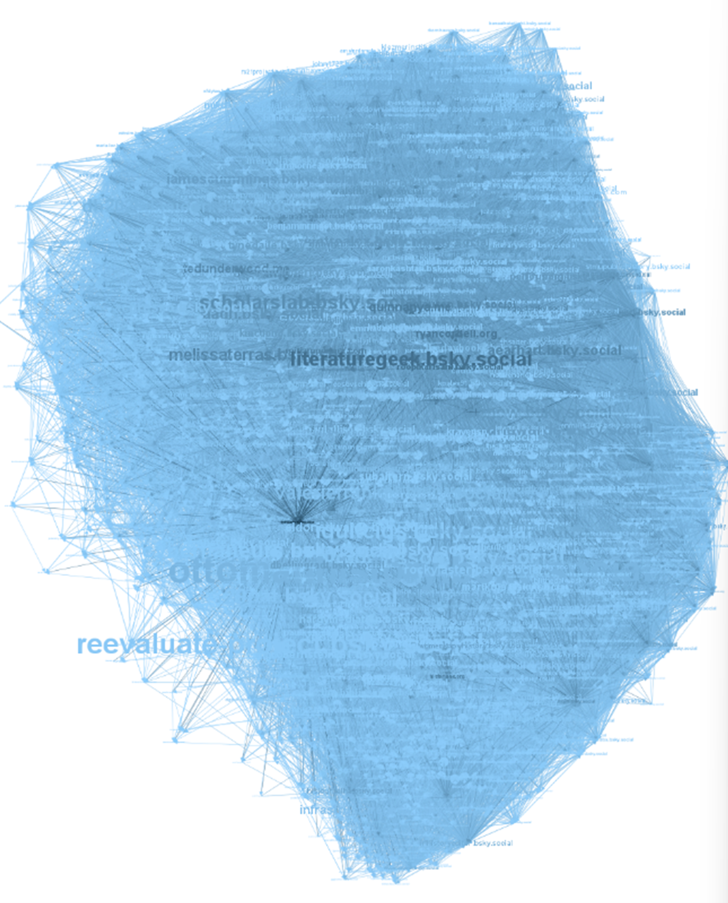

# Case 1: Academic Account
**DHQuarterly**
Handle: @dhquarterly.bsky.social
Followers: 1,312(1291);  followings: 42
Data Collected at 12/08/2025
*Note: The number of followers or followings retrieved may be slightly lower than what appears on the account’s profile page. This difference is typically due to account deactivation or privacy settings, as outlined in the Known Issues section of the README. For all three cases, the exact numbers fetched are provided in brackets following the profile statistics.*
## Step by Step Instructions
### How to Use the Python Scripts
1. Run `1_ego_alter_fetch.py` from the project folder, execute the script and enter the target handle when prompted in the terminal. Example for this case: `dhquarterly.bsky.social` (without the @), then press `Enter`. Wait until the terminal displays: `DID list saved to Alter_dids.txt`. 
2. Run the remaining three scripts in order. No further input is required—just wait for each script to complete. 
   If your dataset is large, you can pause `2_inter_alter_fetch.py` by pressing `p` in the terminal, or stop either `2_inter_alter_fetch.py` or `3_did_handle_match.py` at any time by just closing the program. All processed data is saved automatically and will be resumed from the last checkpoint when you rerun the script.
3. After all four scripts finish, a network summary will appear in the terminal. I recommend copying this output or taking a screenshot to keep a record of your network’s key metrics.
4. For further analysis, just import the `FullNetwork.graphml` file into any network analysis software. In this example, I used **Gephi** for visualisation and metric calculation.

### Further Steps in Gephi
1. **Set node colours and sizes** 
   (Overview > Appearance > Nodes > Ranking)
    Click the `Color` button, set the ranking to In-degree, and choose a light-to-deep blue gradient.
    Then click the `Size` button, set the ranking to Out-degree, and set the maximum size to 20 for clearer contrast.
    **Interpretation:**
    Larger nodes/labels = higher out-degree → this account follows more others.
    Deeper blue nodes = higher in-degree → more influential (more followers).
2. **Apply network layout (Layout window)**
    Choose `ForceAtlas 2` as the layout method.
    This arranges the network visually according to connections and node centrality, helping reveal clusters and relationships.
3. **Finalise visualisation (Preview window)**
    Under `Node Labels`, enable `Show labels` and `Proportional size`.
    Set `Label color` to `Parent` so labels match their corresponding node colour.
    Set `Edges > Color` to `target`, `source`, or `custom`, and switch between them as needed. Changing edge colors in this way can help highlight different connection patterns and make it easier to spot key nodes relevant to your analysis.
    Click `Refresh` to update the preview, then zoom in/out for closer investigation.

## Network Analysis
### Key Metrics Summary
Number of nodes: 1304
Number of edges: 87020
Density: 0.0512
In-degree range: 0 – 1291
Out-degree range: 1 – 896
Average degree centrality: 0.1024
Average betweenness centrality: 0.0010
Average closeness centrality: 0.4290
### Interpretation from the Visuals

From an overall perspective, the network’s structure reveals a distinct directional pattern. Starting from the ego (target) account, alters cluster predominantly toward the vertical and right-hand areas of the visualisation, with a noticeable absence of nodes in the lower-left quadrant. This distribution creates an irregular, diamond-like shape, where most low-degree (less connected) nodes are positioned on the left side of the graph.
Despite this, the network displays relatively strong internal connectivity. Even the lowest out-degree observed is 1, meaning that even the ego account follows back at least one of its followers. Most nodes are also reasonably well-connected to others within the network as when the edge color is set at `mixed`, the overall colour of the network is deep, suggesting a tightly knit community. This is further supported by the network’s average closeness centrality, which is only 0.12 lower than that of the personal account case.
In terms of key actors, several stand out immediately:
1. `literaturegeek.bsky.social` emerges as the most influential node after the ego account.
2. `melissateras.bsky.social` and `scholarslab.bsky.social` also hold notable influence and share overlapping interests with many other nodes.
3. While `reevaluate-project.bsky.social` has a relatively low influence but a high out-degree here, meaning it follows many accounts in this network. Not surprisingly, it maintains a large external following on the platform (over 40k), indicating its broad reach beyond this specific topic.