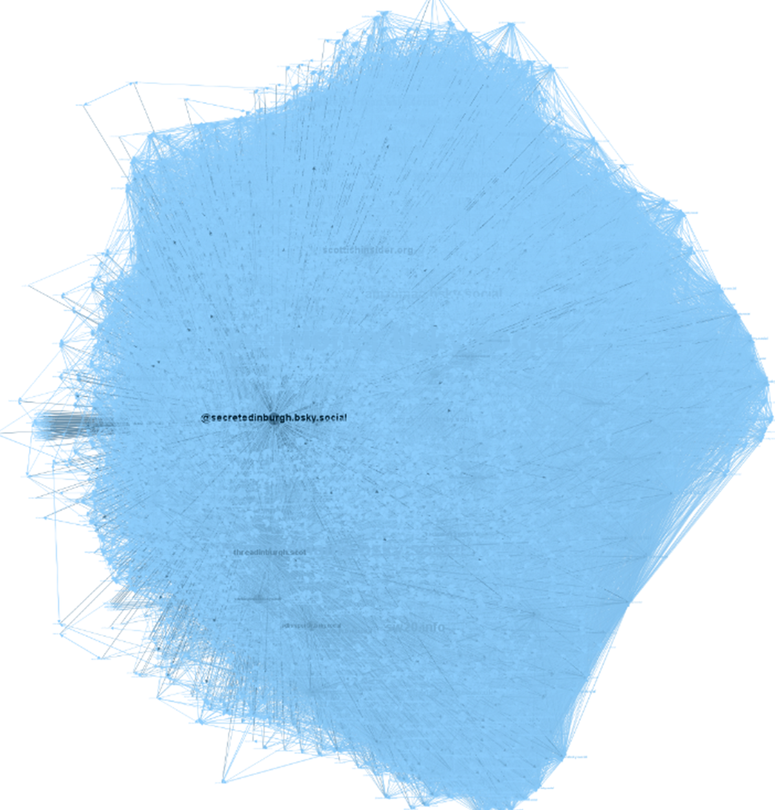
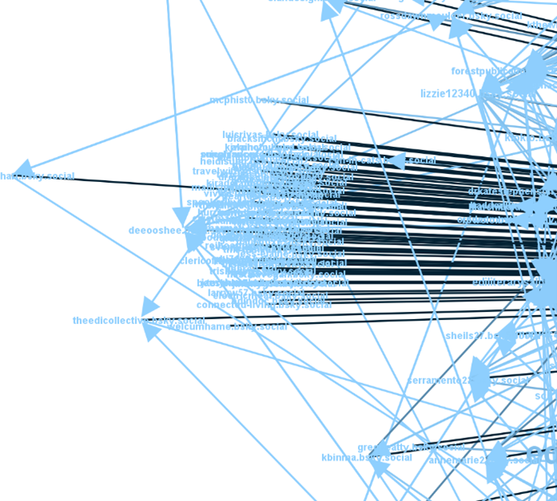

# Case 2: Cultural Page Account
**Secret Edinburgh**
Handle: @secretedinburgh.bsky.social
Followers: 2,967(2864);  followings: 472(451)
Data Collected at 12/08/2025
*Note: The number of followers or followings retrieved may be slightly lower than what appears on the account’s profile page. This difference is typically due to account deactivation or privacy settings, as outlined in the Known Issues section of the README. For all three cases, the exact numbers fetched are provided in brackets following the profile statistics.*
## Network Analysis
### Key Metrics Summary
Number of nodes: 2884
Number of edges: 95881
Density: 0.0115
In-degree range: 0 – 2864
Out-degree range: 0 – 1747
Average degree centrality: 0.0231
Average betweenness centrality: 0.0005
Average closeness centrality: 0.3612
### Interpretation from the Visuals

This network demonstrates a clear dominance of the ego account as the central hub within its community. Its significantly deeper blue colour sets it apart from the rest of the ego-net, indicating a high in-degree. However, its relatively small node size reveals a low out-degree, suggesting limited reciprocity or follow-back behaviour.
Beyond the ego account, only a small number of nodes display noticeably deep colouring, signalling comparatively high influence. These include `threadinburgh.scot`, `scottishindider.org`, e`dinburghminute.bsky.social`, `edinreporter.bsky.social`, and `amzomac.bsky.social`. While these nodes are often scattered individually, they also form small local clusters. Thematically, most are connected to Edinburgh or Scottish news and culture, indicating shared audience segments with the ego account.
The overall connection density of the network is relatively low (0.0115), characterised by a high proportion of single-direction relationships and limited interconnection between alter accounts. This structural sparsity produces an asymmetrical shape, with a noticeable cluster of nodes on the left consisting of accounts that follow only the ego account and no one else in the network. These may represent users with casual or sporadic interest, or potentially automated accounts created to inflate follower numbers. 