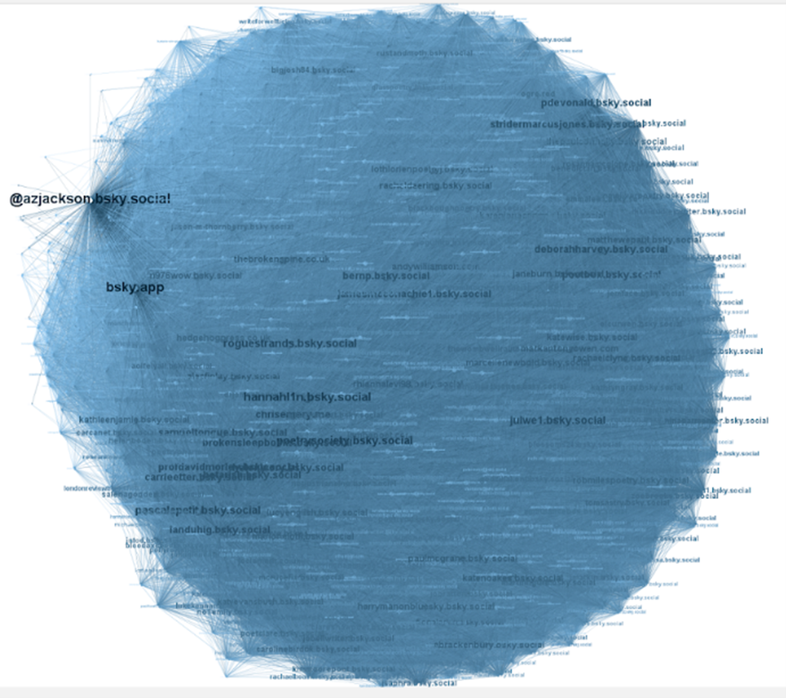

# Case 3: Personal Account
**Andy Jackson**
Handle: @azjackson.bsky.social
Followers: 824(734);  followings: 859(823)
Data Collected at 13/08/2025
*Note: The number of followers or followings retrieved may be slightly lower than what appears on the account’s profile page. This difference is typically due to account deactivation or privacy settings, as outlined in the Known Issues section of the README. For all three cases, the exact numbers fetched are provided in brackets following the profile statistics.*
## Network Analysis
### Key Metrics Summary
Number of nodes: 910
Number of edges: 184257
Density: 0.2228
In-degree range: 0 – 734
Out-degree range: 0 – 823
Average degree centrality: 0.4455
Average betweenness centrality: 0.0009
Average closeness centrality: 0.5477
### Interpretation from the Visuals

The overall colour of this network is relatively deep, reflecting a high degree of interconnection among members of the community. Unlike institutional or official-page ego-nets, the personal account network appears more diverse, with numerous alter nodes standing out at first glance. Nodes with both high and low in-degree are distributed evenly across the graph. While the target account is the largest and deepest-coloured node, it is positioned toward the fringe rather than the centre. This suggests that the ego account exerts influence and engages in interactions comparable to those of its friends, rather than dominating the network.
Structurally, the network is nearly circular, indicating an absence of distinct sub-clusters or specialised interest groups. This is consistent with the personal nature of the ego account’s connections, which are formed primarily through individual relationships rather than around a unifying theme or topic.